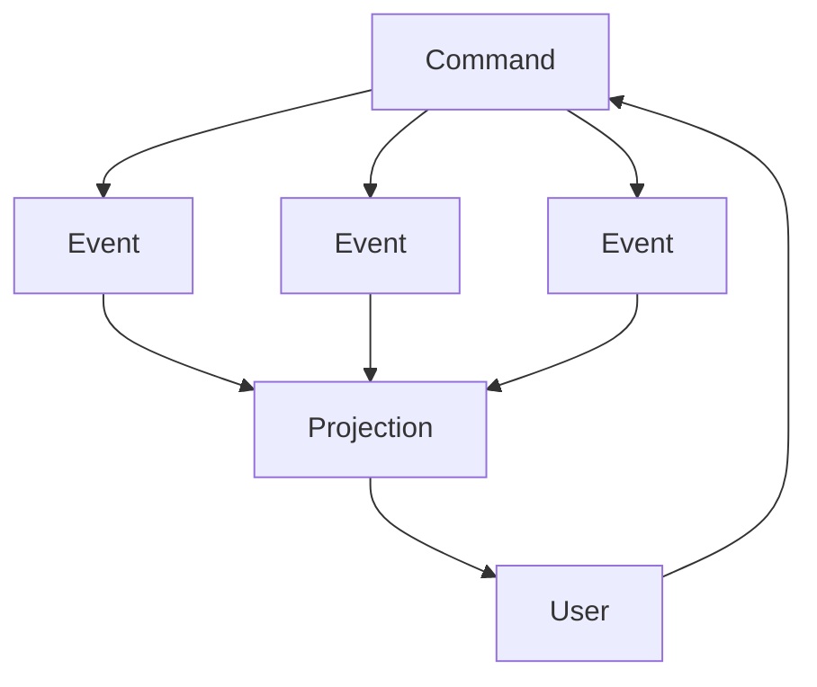
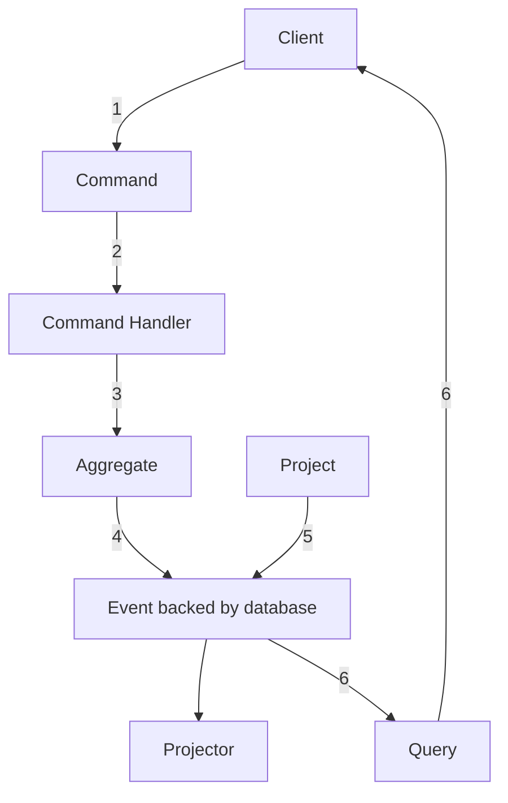

# 6. The anatomy of an event-sourced Application

## Recap

* __EVENTS__ - facts that have occured in the system
* __COMMANDS__ - actions that may results in events being stored in the event store
* __READ MODELS__ - projections or queries of store information

## Additional Building Blocks

* __Command Handler__ - The only component that knows how to handle a command. Business logic may be handled here or delegated to an aggregate
* __Aggregate__ - defines a transactional consistency boundary protecting business invariants across a common set of objects. _These prevent invalid data getting into the system._ After validation, the aggregate writes the data to the system.
* __Projector__ - after the aggregate has written data to the event store, projector components react to this change.
* __Query/Query Handler__ - these abstract away how to get information from the system

Event Source Application Lifecycle (pg 114)
